<h1 align="center">laravel-patent-box-tracker-admin</h1>

<p align="center">
  <strong>The audit-grade web admin panel for <a href="https://github.com/padosoft/laravel-patent-box-tracker"><code>padosoft/laravel-patent-box-tracker</code></a>.</strong><br/>
  Drive every step of an Italian Patent Box dossier — repository discovery, dry-run, async classification, commit/evidence inspection, integrity verification, render &amp; download — from a single operator-grade UI on top of the public HTTP API <code>v1</code>.
</p>

<p align="center">
  <a href="https://github.com/padosoft/laravel-patent-box-tracker"></a>
  <a href="https://github.com/padosoft/laravel-patent-box-tracker/releases/latest"></a>
  
  
  
  
  
  <a href="LICENSE"></a>
  <a href="https://github.com/padosoft/laravel-patent-box-tracker-admin/issues"></a>
  <a href="https://github.com/padosoft/laravel-patent-box-tracker-admin/pulls"></a>
  <a href="https://github.com/padosoft/laravel-patent-box-tracker-admin/commits/main"></a>
</p>

<p align="center">
  <em>The web cockpit for documentazione idonea filings — operator-first UI, hash-chain integrity check on a button click, no business logic duplicated.</em>
</p>

<p align="center">
  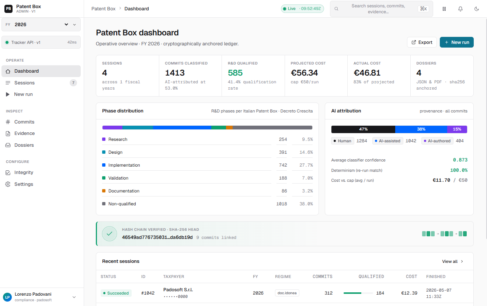
</p>

---

## Table of contents

1. [Why this panel exists](#why-this-panel-exists)
2. [What you get](#what-you-get)
3. [How it relates to the tracker](#how-it-relates-to-the-tracker)
4. [Architecture in 30 seconds](#architecture-in-30-seconds)
5. [Screenshots](#screenshots)
6. [UI map](#ui-map)
7. [Installation](#installation)
8. [Quick start](#quick-start)
9. [Configuration reference](#configuration-reference)
10. [Operator workflows](#operator-workflows)
11. [HTTP API surface consumed (v1)](#http-api-surface-consumed-v1)
12. [Security model](#security-model)
13. [🚀 AI vibe-coding pack included](#ai-vibe-coding-pack-included)
14. [Project layout](#project-layout)
15. [Testing](#testing)
16. [Roadmap](#roadmap)
17. [Contributing](#contributing)
18. [License &amp; credits](#license--credits)

---

## Why this panel exists

[`padosoft/laravel-patent-box-tracker`](https://github.com/padosoft/laravel-patent-box-tracker) is **API-first and CLI-first by design**. It produces audit-grade Italian Patent Box dossiers (110% R&amp;D super-deduction, *documentazione idonea* regime under D.M. 6 ottobre 2022) from a deterministic, hash-chained pipeline — but it ships *headless*.

That is the right call for production servers, CI jobs and `composer require` consumers. It is the **wrong call for the human in the loop**: the commercialista, the auditor, the project lead who needs to:

- launch a new fiscal-year run without writing YAML;
- read the cost-cap projection before authorising the spend;
- watch a queued classification job advance, not poll a CLI;
- audit a single commit's classification, see the rationale, the evidence used, the AI-attribution verdict;
- click a button to verify the per-commit hash chain and read "verified ✓" or the exact tampered row;
- preview the rendered PDF, then download the JSON sidecar from the same screen.

`laravel-patent-box-tracker-admin` is that panel. It owns **zero** business logic. Every action it performs is one HTTP call against the tracker's public **v1** API. Anything you can do in the panel, you can also do via cURL, Postman, or the Artisan commands — the panel just makes it humane.

> If the tracker is the **engine** that produces the dossier, this admin is the **dashboard** the operator sits in front of.

## What you get

- 🧭 **Operator-first console** — sidebar navigation, dashboard, sessions list, run wizard, session detail, dossier center. No marketing hero, no landing chrome — built like a back-office tool for fiscal review.
- 🚀 **Run wizard** — multi-step form: repositories &amp; roles, period, tax identity (denomination / P.IVA / regime / fiscal year), classifier (provider/model/seed), cost cap, dry-run preview, then queue.
- 💸 **Cost projection up front** — the dry-run output (`projected_cost_eur`) is shown before the operator clicks *launch*; the cost cap is honoured by the package and surfaced as a `cost_cap_exceeded` banner if hit.
- 🧪 **Live polling** — sessions in `pending` / `queued` / `running` are refreshed in the background; the UI flips to `classified` / `failed` without a manual reload.
- 🔬 **Commit explorer** — filter by phase, AI attribution, R&amp;D qualification, confidence range, repository path; read the model's rationale per commit; see the `prev_hash` / `self_hash` row right next to the SHA.
- 🧷 **Evidence inspector** — design-doc / ADR / spec / lesson-learned correlations linked back to the commits that referenced them, with `kind`, `slug`, `path`, `linked_commit_count`.
- 📑 **Dossier center** — list every rendered artefact (PDF / JSON), see byte size and `sha256`, trigger a new render job, download from a session-scoped, ownership-checked endpoint.
- 🔗 **Hash-chain verification on demand** — calls `GET /v1/tracking-sessions/{id}/integrity` and tells you `verified: true` or the exact `first_failure` row. The dossier only counts as audit-grade if this button stays green.
- 🛡️ **Bearer-token gate** — the panel respects `PATENT_BOX_API_TOKEN` end-to-end. The token never leaves the browser (`localStorage`-scoped, sent as `Authorization: Bearer …`).
- ⚙️ **Runtime config** — base URL, token, timeout and enable/disable flag are stored client-side and overridable via `?apiBase=…&amp;apiToken=…&amp;apiEnabled=0` query params for support sessions.
- 🚦 **Stable error UX** — the v1 error taxonomy (`validation_failed`, `not_found`, `conflict`, `cost_cap_exceeded`, `internal_error`) maps to consistent banners; the legacy `invalid_repository` code is auto-aliased to `validation_failed` for older trackers.
- 🤖 **Vibe-coding pack in the box** — drop the repo into Claude Code and the panel-specific skills, agents and rules under `.claude/skills/` activate automatically. See [🚀 AI vibe-coding pack included](#-ai-vibe-coding-pack-included).

## How it relates to the tracker

```
┌─────────────────────────────────┐         ┌──────────────────────────────────────┐
│ laravel-patent-box-tracker-admin│  HTTP   │ padosoft/laravel-patent-box-tracker  │
│  (this repo)                    │ ──────▶ │  (engine)                            │
│                                 │  v1 API │                                      │
│  • React 18 + JSX UI            │         │  • CLI: patent-box:track / render /  │
│  • Operator console             │         │    cross-repo                        │
│  • Run wizard / detail / dossier│         │  • Fluent PHP builder                │
│  • Live polling                 │         │  • Deterministic LLM classifier      │
│  • Hash-chain verify button     │         │  • Hash-chain + dossier renderer     │
│  • Bearer token (optional)      │         │  • Italian fiscal A4 PDF + JSON      │
│                                 │         │  • Stable HTTP API v1                │
└─────────────────────────────────┘         └──────────────────────────────────────┘
```

| Concern | Tracker (`laravel-patent-box-tracker`) | Admin (this repo) |
|---|---|---|
| Walks git history, classifies commits | ✅ owns it | ❌ never |
| Hash-chain construction &amp; verification | ✅ owns it | ❌ surfaces it |
| Italian fiscal A4 PDF / JSON rendering | ✅ owns it | ❌ surfaces it |
| Cost-cap pre-flight guard | ✅ enforces it | 👀 displays it |
| Public HTTP API contract (v1) | ✅ defines it | 👀 consumes it |
| Operator UX (wizard, detail, dossier) | ❌ headless | ✅ owns it |
| Token / rate-limit configuration | ✅ provides knobs | 👀 reads them |

**Zero coupling, one contract.** The tracker can run for years without this admin (CLI / API only). The admin can talk to a tracker on a different host, a different deploy, even a different team.

## Architecture in 30 seconds

The current admin baseline is a **static React 18 + JSX prototype** served by `index.html` + `@babel/standalone` (no build step required) — designed to be embedded into a Laravel 12 / 13 host or served as-is from any static-capable Laravel route. The path forward (tracked in `docs/ENTERPRISE_PLAN.md` Macro 7) wires it into a real Vite + Inertia / React build before the `v1.0.0` admin tag.

- `project/index.html` — the shell.
- `project/api-client.jsx` — the typed-like API client; the only file that talks to the tracker.
- `project/app.jsx`, `project/shell.jsx` — root state + sidebar/topbar.
- `project/pages-dashboard.jsx`, `pages-sessions.jsx`, `pages-detail.jsx`, `pages-newrun.jsx`, `pages-misc.jsx` — operator screens.
- `project/data.jsx`, `project/ui.jsx`, `project/tweaks-panel.jsx` — fixtures, primitives, dev tools.
- `project/styles.css`, `project/patentbox.css` — Patent Box visual language (dark by default, audit-grade typography).

## Screenshots

A walk-through of every operator surface. PNGs live under [`resources/screenshoots/`](resources/screenshoots) and are committed to the repo so you can browse them straight from GitHub.

### Dashboard — light theme

Operative overview for the active fiscal year: KPI tiles (sessions, classified commits, R&amp;D-qualified, projected/actual cost vs. cap, dossiers), phase distribution, AI attribution mix, hash-chain health badge, recent sessions feed.

<p align="center">
  
</p>

### Dashboard — dark theme

Same surface in dark mode. Theme toggle is in the topbar; preference is persisted client-side.

<p align="center">
  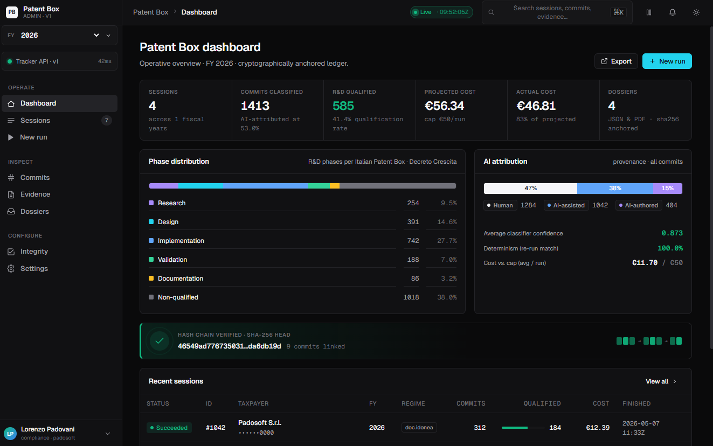
</p>

### Sessions list

Filterable table of every tracking session with status, fiscal year, regime, qualified-commit ratio, projected vs. actual cost, and finished-at timestamp.

<p align="center">
  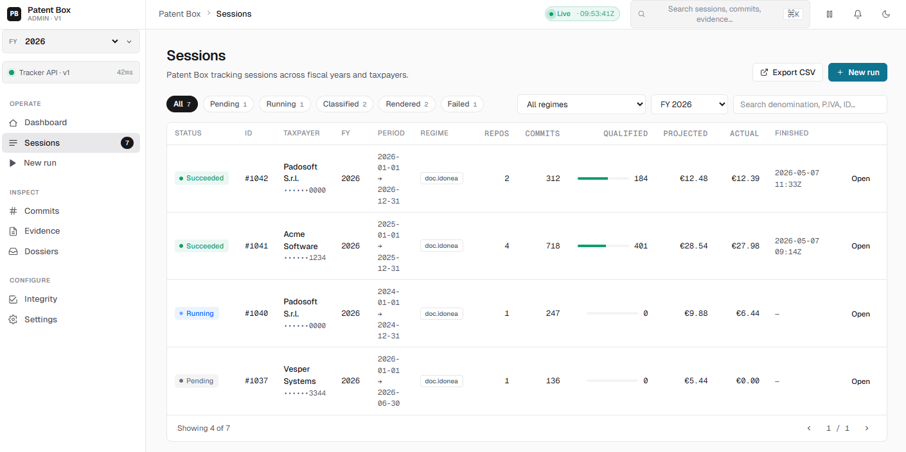
</p>

### New run wizard

Multi-step wizard backed by `POST /v1/repositories/validate` → `POST /v1/tracking-sessions/dry-run` → `POST /v1/tracking-sessions`. The dry-run output (`projected_cost_eur`) is shown before launch so the operator authorises spend with eyes open.

<p align="center">
  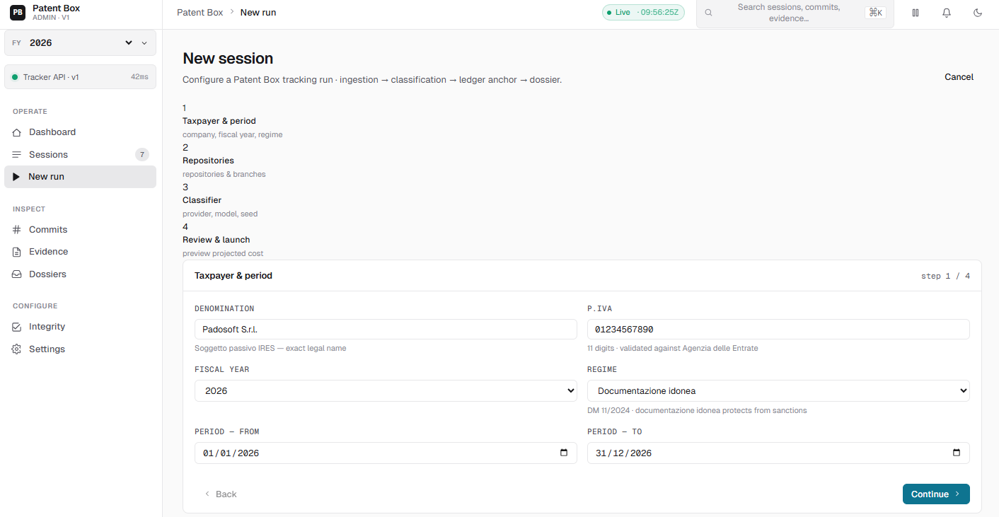
</p>

### Session detail — header &amp; commits

The audit screen: session header (status, classifier, period, tax identity, hash-chain head), then the commits explorer with phase / AI attribution / R&amp;D qualification / confidence filters and per-commit `prev_hash` / `self_hash` rows.

<p align="center">
  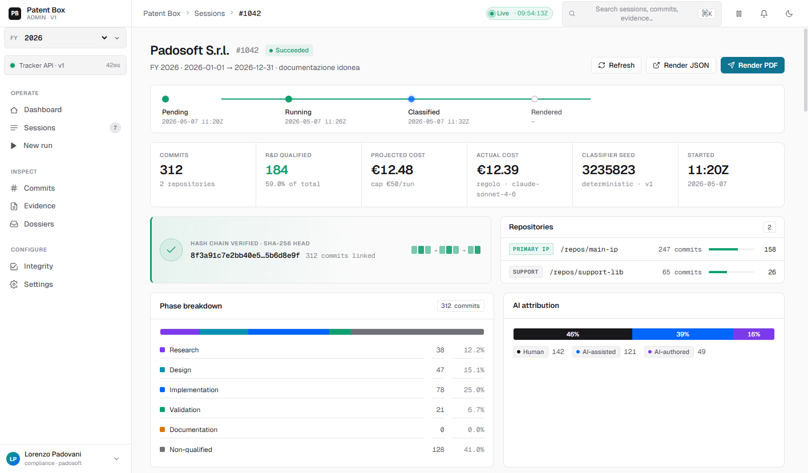
</p>

<p align="center">
  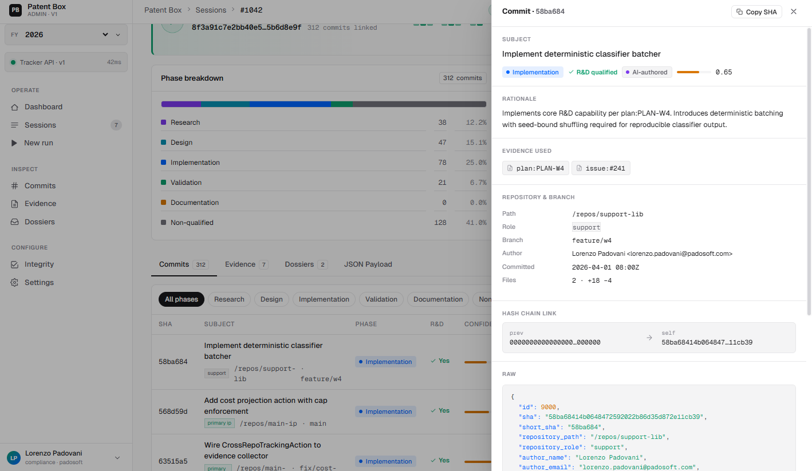
</p>

<p align="center">
  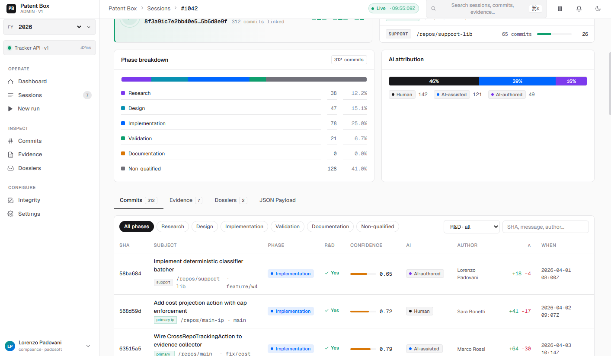
</p>

### Evidence library

Design-doc / ADR / spec / lessons-learned correlations linked back to the commits that referenced them. Filter by `kind`, `slug`, `path_like`, search.

<p align="center">
  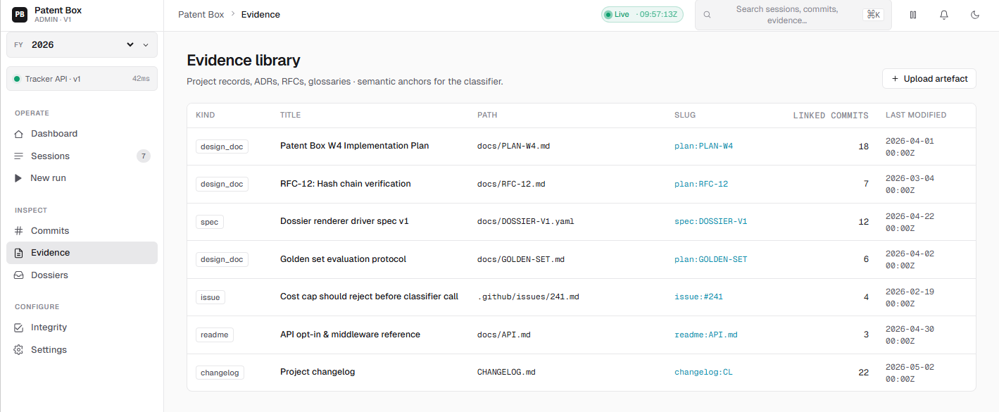
</p>

### Dossier center

Render trigger (PDF / JSON), per-artefact `sha256`, byte size, generation timestamp, ownership-scoped download link. Backed by `POST /v1/tracking-sessions/{id}/dossiers` and `GET …/dossiers/{dossierId}/download`.

<p align="center">
  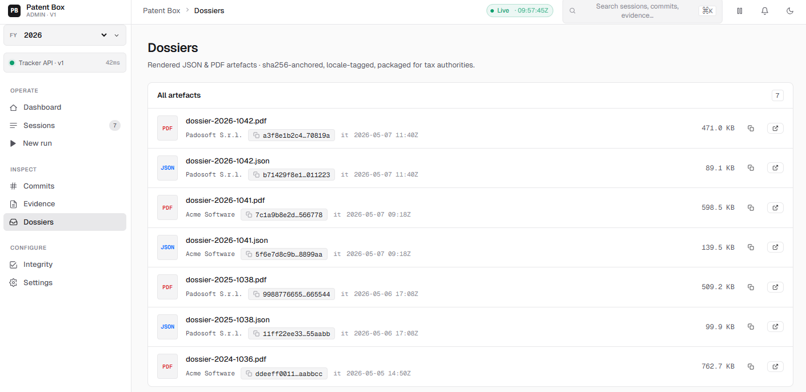
</p>

### Integrity / health

API health badge (`GET /v1/health`), capabilities readout (`GET /v1/capabilities`) and the per-session hash-chain verification view that calls `GET /v1/tracking-sessions/{id}/integrity`.

<p align="center">
  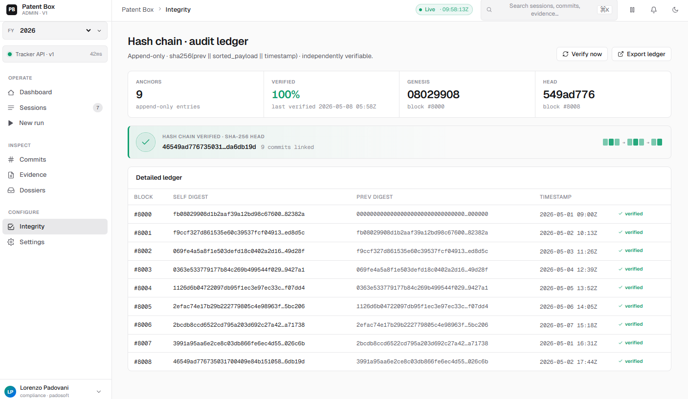
</p>

### Settings

Runtime panel configuration: tracker base URL, optional bearer token, request timeout, enable/disable flag. The current static baseline reads its config from `localStorage` (key `__PB_ADMIN_API_CONFIG__`) when present, so persistence is currently driven externally — either by setting the key manually from the browser devtools, or by a future settings form (planned in Macro 6 polish; tracked in `docs/ENTERPRISE_PLAN.md`).

<p align="center">
  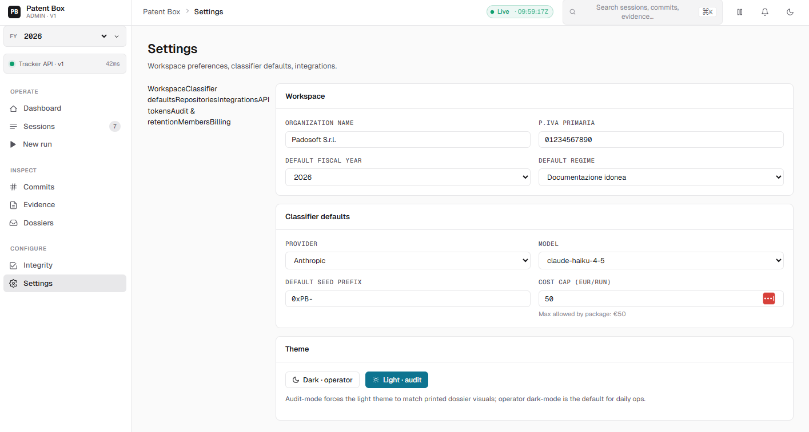
</p>

## UI map

The panel ships five operator surfaces. Names match `project/pages-*.jsx`:

| Surface | What it shows | Backed by API |
|---|---|---|
| **Dashboard** | KPI tiles (sessions, qualified commits, projected/actual cost), recent runs, integrity health | `GET /v1/health`, `GET /v1/capabilities`, `GET /v1/tracking-sessions` |
| **Sessions list** | Filterable table by `status`, `fiscal_year`, `regime`, period, search | `GET /v1/tracking-sessions` |
| **Run wizard** | Repos &amp; roles → period → tax identity → classifier → cost cap → dry-run → launch | `POST /v1/repositories/validate`, `POST /v1/tracking-sessions/dry-run`, `POST /v1/tracking-sessions` |
| **Session detail** | Timeline, commits explorer, evidence explorer, dossiers tab, integrity badge | `GET /v1/tracking-sessions/{id}`, `…/commits`, `…/evidence`, `…/dossiers`, `…/integrity` |
| **Dossier center** | Render trigger (PDF / JSON), status, sha256, byte size, ownership-scoped download | `POST …/dossiers`, `GET …/dossiers/{id}`, `GET …/dossiers/{id}/download` |

## Installation

> Requires a running `padosoft/laravel-patent-box-tracker` (>= `v1.0.0`, recommended `v1.0.1` for the security floor) reachable on the network.

### Option A — drop-in static (current baseline)

Clone the repo and serve `project/` from any static-capable host (Nginx, Caddy, Laravel `Route::view`, GitHub Pages, S3 + CloudFront):

```bash
git clone https://github.com/padosoft/laravel-patent-box-tracker-admin.git
cd laravel-patent-box-tracker-admin
# any static server — example with PHP built-in:
php -S 127.0.0.1:8001 -t project
```

Then point your browser at `http://127.0.0.1:8001/?apiBase=https://your-tracker.example/api/patent-box`.

### Option B — Laravel host integration (Composer)

```bash
composer require padosoft/laravel-patent-box-tracker-admin
php artisan vendor:publish --tag=patent-box-admin-assets
```

Assets are published to:

```text
public/vendor/patent-box-admin
```

Then mount it from Laravel, for example:

```php
Route::view('/patent-box-admin', 'patent-box-admin-shell');
```

with a blade shell that points scripts/styles to `/vendor/patent-box-admin/*`.

## Quick start

1. **Boot the tracker** (in its own repo):

   ```bash
   composer require padosoft/laravel-patent-box-tracker
   php artisan migrate
   # optional: gate the API
   echo "PATENT_BOX_API_TOKEN=$(openssl rand -hex 32)" >> .env
   php artisan serve
   ```

2. **Open this admin** with the tracker base URL in the query string (only needed once — it persists in `localStorage`):

   ```
   http://localhost:8001/?apiBase=http://localhost:8000/api/patent-box&apiToken=<your-token>
   ```

3. **Click "New run"**, pick repositories &amp; roles, period (e.g. `2026-01-01 → 2026-12-31`), tax identity, the classifier provider/model. Hit **Dry-run** to see the projected cost. Hit **Launch**.

4. **Watch the session move** through `pending → queued → running → classified` on the detail page.

5. **Open the Dossiers tab**, click **Render PDF** (or **Render JSON**), then **Download**. The dossier is delivered through a session-scoped, ownership-checked endpoint.

6. **Click "Verify integrity"**. The button calls `GET /v1/tracking-sessions/{id}/integrity` and either flips green ("hash chain verified, head = `…`, commits = N") or shows the exact `first_failure` row.

That's the full audit-grade flow, from `git log` to *documentazione idonea*-ready PDF, in a few minutes.

## Configuration reference

The admin reads its runtime config from these sources, with the actual resolution order applied by `project/api-client.jsx`:

1. **Built-in defaults** — `baseUrl=/api/patent-box`, `timeoutMs=30000`, `enabled=true`. The seed values used when nothing else is provided.
2. **Query string** — `?apiBase=…`, `?apiToken=…`, `?apiTimeout=30000`, `?apiEnabled=0|1`. Parsed on every navigation but **never written back**: tokens placed in the URL stay visible in the address bar, browser history and `Referer` headers, so prefer the storage path below for anything sensitive.
3. **`localStorage`** (highest precedence for `baseUrl`, `token`, `enabled`) — key `__PB_ADMIN_API_CONFIG__`, JSON `{baseUrl, token, enabled}`. When this key is present, its values **override** anything passed via the query string for those three fields. `apiTimeout` is currently not loaded from storage and always uses the query-string value or the built-in default. The static baseline only **reads** the storage key — populate it manually from devtools, e.g. `localStorage.setItem('__PB_ADMIN_API_CONFIG__', JSON.stringify({baseUrl: '…', token: '…', enabled: true}))`. A settings form that writes the key is tracked for the Macro 6 polish slice in `docs/ENTERPRISE_PLAN.md`.

**Practical implication:** if you pass `?apiToken=…&apiBase=…` to bootstrap a fresh browser session, those values are picked up. As soon as the storage key exists, however, the storage values win — so an existing token in `localStorage` will be used even if a new one is provided in the URL. Clear the storage key (`localStorage.removeItem('__PB_ADMIN_API_CONFIG__')`) before re-bootstrapping with new URL params.

The base URL is normalised: if it does not already end with `/v1`, the suffix is appended automatically. This means the same value works whether you point at `/api/patent-box` or `/api/patent-box/v1`.

| Knob | Default | Effect |
|---|---|---|
| `apiBase` | `/api/patent-box` | Tracker base URL, with or without `/v1` |
| `apiToken` | `null` | If set, sent as `Authorization: Bearer <token>` |
| `apiTimeout` | `30000` ms | Per-request timeout (`AbortController`) |
| `apiEnabled` | `true` | When `false`, all requests short-circuit with `api_disabled` (good for offline demos) |

## Operator workflows

### New fiscal-year run

```
Sidebar ▸ New run
    └─ step 1 — repositories & roles
        ├─ each repo POST /v1/repositories/validate
        └─ duplicates blocked client-side
    └─ step 2 — period (from / to / fiscal_year)
    └─ step 3 — tax identity (denomination, p_iva, regime)
    └─ step 4 — classifier (provider, model, seed, cost_cap_eur)
    └─ step 5 — POST /v1/tracking-sessions/dry-run  → review projected_cost_eur
    └─ step 6 — POST /v1/tracking-sessions          → enqueue
```

### Inspect &amp; verify a session

```
Sidebar ▸ Sessions ▸ <row>
    ├─ Overview tab     — KPI, classifier, period, tax identity
    ├─ Commits tab      — filters, rationale, AI attribution, hash chain row
    ├─ Evidence tab     — design-doc / ADR / spec / lessons correlations
    ├─ Dossiers tab     — render + download
    └─ Integrity badge  — GET /v1/tracking-sessions/{id}/integrity
```

### Render &amp; download a dossier

```
Detail ▸ Dossiers tab ▸ Render PDF  (or JSON)
    └─ POST /v1/tracking-sessions/{id}/dossiers
    └─ row appears as queued → ready
    └─ Download → GET /v1/tracking-sessions/{id}/dossiers/{dossierId}/download
```

## HTTP API surface consumed (v1)

The admin only talks to the public, versioned, frozen v1 surface of the tracker. The full mapping lives in `project/api-client.jsx`.

| Method | Endpoint | Admin usage |
|---|---|---|
| `GET` | `/v1/health` | Health badge in topbar |
| `GET` | `/v1/capabilities` | Feature flags (PDF engine availability, locale list) |
| `POST` | `/v1/repositories/validate` | Wizard step 1 |
| `POST` | `/v1/tracking-sessions/dry-run` | Wizard step 5 |
| `POST` | `/v1/tracking-sessions` | Wizard step 6 (queue) |
| `GET` | `/v1/tracking-sessions` | Sessions list + dashboard recent runs |
| `GET` | `/v1/tracking-sessions/{id}` | Session detail header |
| `GET` | `/v1/tracking-sessions/{id}/commits` | Commits explorer |
| `GET` | `/v1/tracking-sessions/{id}/evidence` | Evidence explorer |
| `GET` | `/v1/tracking-sessions/{id}/dossiers` | Dossiers tab |
| `POST` | `/v1/tracking-sessions/{id}/dossiers` | Render trigger |
| `GET` | `/v1/tracking-sessions/{id}/dossiers/{dossier}` | Dossier detail (drawer planned) |
| `GET` | `/v1/tracking-sessions/{id}/dossiers/{dossier}/download` | Download link |
| `GET` | `/v1/tracking-sessions/{id}/integrity` | Verify-integrity button |

**Envelope:** every response is `{data, meta?, error?}`. Errors carry one of the frozen codes from the v1 taxonomy: `validation_failed`, `not_found`, `conflict`, `cost_cap_exceeded`, `internal_error`. The legacy `invalid_repository` is auto-aliased to `validation_failed` for older trackers (see `ERROR_CODE_ALIAS` in `api-client.jsx`).

## Security model

- **No business logic on the client.** Authorisation, ownership checks, path-traversal hardening and rate limiting are enforced by the tracker. The admin only displays errors.
- **Prefer `localStorage` over URL params for the bearer token.** The static baseline reads `apiToken` from the query string when present, but does **not** rewrite the URL — tokens passed via `?apiToken=…` stay visible in the address bar, browser history and outgoing `Referer` headers. For anything beyond a one-shot demo, set the token straight into `localStorage` under `__PB_ADMIN_API_CONFIG__` (devtools console: `localStorage.setItem('__PB_ADMIN_API_CONFIG__', JSON.stringify({baseUrl: '…', token: '…', enabled: true}))`). URL cleanup + a settings form are tracked for the Macro 6 polish slice.
- **Session-scoped downloads.** Dossier downloads always go through `…/tracking-sessions/{id}/dossiers/{dossierId}/download`, which is ownership-checked server-side. The admin never builds direct filesystem URLs.
- **Strict envelope.** A non-`{data|error}` response is treated as a transport failure, not user-actionable success.
- **No secrets in the repo.** Provider keys (`REGOLO_API_KEY`, `OPENAI_API_KEY`, …) live exclusively in the tracker's `.env`.

If you find a security issue, please follow the [SECURITY policy](https://github.com/padosoft/laravel-patent-box-tracker/blob/main/SECURITY.md) of the tracker repo (single coordinated disclosure channel for the whole stack).

## 🚀 AI vibe-coding pack included

This admin ships with a Padosoft-flavoured **Claude Code pack** under `.claude/skills/`, on top of the same vibe-coding bundle distributed by the tracker. Open the repo in [Claude Code](https://claude.com/claude-code) and the agent picks up the panel-specific guardrails automatically — no manual prompting, no copy-paste of conventions.

What's in the box:

- **`.claude/skills/patent-box-admin-enterprise/SKILL.md`** — the operating-system skill. Forces the read-order (`docs/PROGRESS.md` → `docs/ENTERPRISE_PLAN.md` → `docs/RULES.md` → `docs/LESSON.md` → agents → skills), the macro/subtask branch model, the upstream pin (currently `v1.0.1`) and the full v1 endpoint surface.
- **`.claude/skills/copilot-pr-review-loop/SKILL.md`** — the mandatory loop after every push: open PR → request Copilot reviewer → verify it landed (`gh pr edit` primary, GraphQL fallback included) → wait for CI → resolve actionable comments → merge. No subtask is "done" until this loop has run.
- **Operating guardrails** — `AGENTS.md`, `CLAUDE.md`, `agent.md`, `agents.md`, `docs/RULES.md`, `docs/LESSON.md` declare the non-negotiables (no business logic on the client, contract-only consumption of the tracker, README/CHANGELOG updated before release, hash-chain integrity surfaced before merge of UX changes that touch dossiers).

If you do not use Claude Code, the pack is harmless — it sits in `.claude/` and reads as plain Markdown documentation. If you do, the panel becomes effectively self-onboarding: the agent will refuse to add a button that bypasses the v1 envelope, will keep `docs/PROGRESS.md` current, and will run the Copilot loop before claiming a subtask is closed.

> The same vibe-coding philosophy ships in the tracker repo. Together, the two packs make the **engine + cockpit** pair AI-collaborator-friendly out of the box.

## Project layout

```
laravel-patent-box-tracker-admin/
├── .claude/
│   └── skills/
│       ├── patent-box-admin-enterprise/SKILL.md
│       └── copilot-pr-review-loop/SKILL.md
├── docs/
│   ├── ENTERPRISE_PLAN.md     # macro/subtask roadmap + completion table
│   ├── PROGRESS.md            # session-by-session status log
│   ├── RULES.md               # absolute rules + upstream pin
│   └── LESSON.md              # reusable findings
├── project/
│   ├── index.html             # shell
│   ├── api-client.jsx         # the only file that calls the tracker
│   ├── app.jsx                # root state, polling, navigation
│   ├── shell.jsx              # sidebar + topbar
│   ├── pages-dashboard.jsx
│   ├── pages-sessions.jsx
│   ├── pages-newrun.jsx
│   ├── pages-detail.jsx
│   ├── pages-misc.jsx
│   ├── data.jsx               # fixtures
│   ├── ui.jsx                 # primitives
│   ├── tweaks-panel.jsx       # dev tooling
│   ├── styles.css
│   ├── patentbox.css
│   └── uploads/               # design assets
├── AGENTS.md / CLAUDE.md / agent.md / agents.md
└── README.md                  # ← you are here
```

## Testing

The current baseline is a static prototype, so the gate matrix is conservative:

- **Backend regression on the tracker** (run in the tracker repo): `composer validate --strict --no-check-publish` + `composer test`.
- **Frontend regression on the admin** (baseline in place; expand coverage in Macro 7): `npm run test` (structure check), `npm run build` (alias for the same gate today), `npm run e2e` (Playwright smoke). The `.github/workflows/ci.yml` workflow runs the structure check + the Chromium smoke on every push to `main` and every PR. Wider coverage — one Playwright scenario per operator workflow — is tracked for the Macro 7 release slice.
- **Manual smoke** (today): open the panel, run the dry-run → launch → poll → render → download → verify-integrity sequence end-to-end against a local tracker.

Test status, blockers, and CI gaps are tracked in [`docs/PROGRESS.md`](docs/PROGRESS.md) and the completion table in [`docs/ENTERPRISE_PLAN.md`](docs/ENTERPRISE_PLAN.md).

## Roadmap

The macro/subtask plan is in [`docs/ENTERPRISE_PLAN.md`](docs/ENTERPRISE_PLAN.md). Snapshot:

| Macro | Scope | Status |
|---|---|---|
| 0 | Operating-system bootstrap (this repo) | ✅ Done |
| 1–4 | API foundation / read / write / security (tracker) | ✅ Done upstream in `v1.0.0` / `v1.0.1` |
| 5 | Admin API client foundation | ✅ Done — full v1 surface in `project/api-client.jsx` |
| 6 | Admin UX + design implementation | ✅ Done |
| 7 | Contracts, docs, release, tag | ✅ Done (`v1.0.0`) |

Current milestone:

1. Macro 0–7 completed.
2. Admin `v1.0.0` released with Composer install path (`vendor:publish --tag=patent-box-admin-assets`).
3. Tracker compatibility floor remains `>= v1.0.1`.

## Contributing

PRs are welcome — please follow the macro/subtask branch model documented in [`docs/RULES.md`](docs/RULES.md) and the Copilot review loop in [`.claude/skills/copilot-pr-review-loop/SKILL.md`](.claude/skills/copilot-pr-review-loop/SKILL.md). In short:

1. branch from `main` with the canonical naming `task/<name>` (e.g. `task/admin-integrity-button`); use the dash-equivalent `task-admin-<scope>` only when your local toolchain blocks slash-named branches, and document the deviation in `docs/PROGRESS.md` (see `docs/RULES.md`);
2. implement one bounded slice;
3. update [`docs/PROGRESS.md`](docs/PROGRESS.md);
4. open a PR, request the **Copilot** reviewer (primary `gh pr edit <PR> --add-reviewer @copilot`, GraphQL fallback documented in the skill);
5. resolve every actionable comment + green CI before merge.

Issues that touch the public v1 contract should be raised in the [tracker repo](https://github.com/padosoft/laravel-patent-box-tracker/issues) — this admin tracks the tracker, never the other way around.

## License &amp; credits

- License: **Apache-2.0**, matching the tracker.
- Author: **Lorenzo Padovani** ([@padosoft](https://github.com/padosoft)).
- Built on top of [`padosoft/laravel-patent-box-tracker`](https://github.com/padosoft/laravel-patent-box-tracker) — the engine that does the real Patent Box work.
- Vibe-coding pack: shared baseline with the [Padosoft Claude Code pack](https://github.com/padosoft) shipped across the family of `padosoft/*` packages.
- For *documentazione idonea* legal context: D.M. 6 ottobre 2022 + provv. AdE 15 febbraio 2023. This panel is a tool, not legal advice — your commercialista is still the source of truth for what counts as qualified R&amp;D.

> Built by an Italian Patent Box filer for Italian Patent Box filers.
